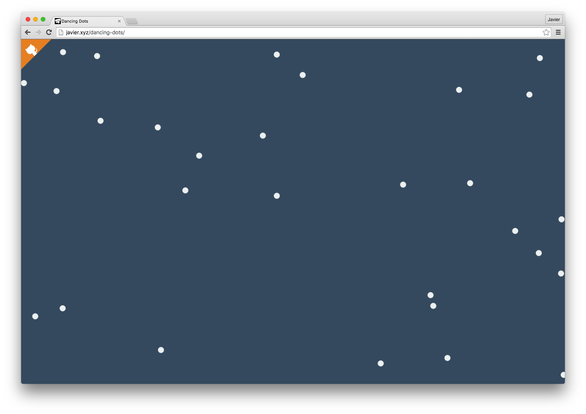

# [DancingDots](http://javierbyte.github.io/dancing-dots/)

[](http://javierbyte.github.io/dancing-dots/)

A library to get nice step by step dot coordinates with nice movement.

Have you ever wanted to get a set of points, and then move them like if they have a nice trayectory? No? Maybe you will want now.

## Usage

Get from npm
```
  npm install dancing-dots --save
```

Instanciate dancing dots.

```js
  const DancingDots = require('dancing-dots')
  const dots = new DancingDots(configurationObject)
```

The configuration object can have the following properties:

  * `dotCount`. Integer. How many dots do you want? Defaults to `10`.
  * `speed`. Integer. How fast do you want the dots to move? Defaults to `5`.
  * `width`. Integer. The width of the grid. Defaults to `100`.
  * `height`. Integer. The height of the grid. Defaults to `100`.
  * `getOnlyInts`. Boolean. Do you want only integers in your results?. Defaults to `true`.


## Get the dots.

```js
  dots.getCoords()
```

You get:

```js
  [{
    x: 40,
    y: 40
  }, {
    x: 14,
    y: 99
  }, {
    x: 66,
    y: 70
  },
  ...
```

## Update and get the dots.

```js
  dots.getCoordsAndUpdate()
```

That updates the position of the dots, and returns the new positions, just like `getDots()`.